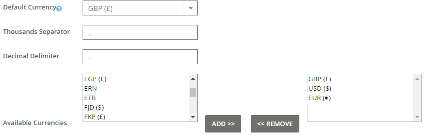
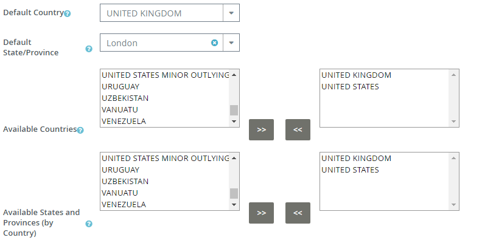
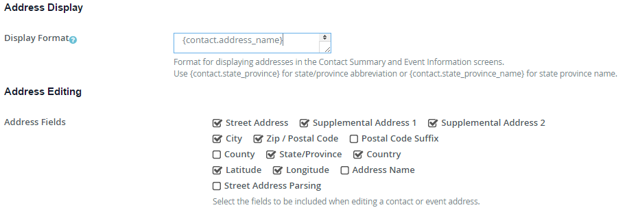
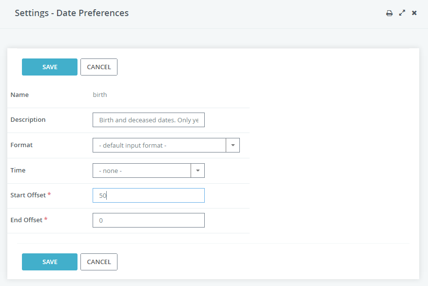

Localise CiviHR
==========

### Pick currencies, countries, states 

Go to **Administer > Localisation > Languages, Currency, Locations**.

Currency: Pick the currency that you would use most frequently as the default. Note that you can use more than one currency in your CiviHR site. 

Countries and states: Set the country that would occur most frequently in your data as the default. Add other countries that you might need while saving the contact information of any staff member. You may also select and add all countries at one go. Add the same countries to the States and Provinces list. 

### Pick address fields  

Go to **Administer > Localisation > Address Settings**, and select the address related fields that you would like to use. For example if your country uses postal code suffix, you can enable that from here. You can also uncheck and hide fields that you don't need. 

### Pick preferred date format

Go to **Administer > Localisation > Date Formats** and pick the date and time input format that you prefer working with. For example, if you would like to input dates as dd/mm/yyyy, you can set that here. 

By default, CiviHR provides ranges for input on specific date fields. For example, by default the date of birth field can go back 100 years from current date and zero years in future. If you would like to change this range, you can do so from the Date Preferences screen at **Administer > Customise Data and Screens > Date Preferences**. 

