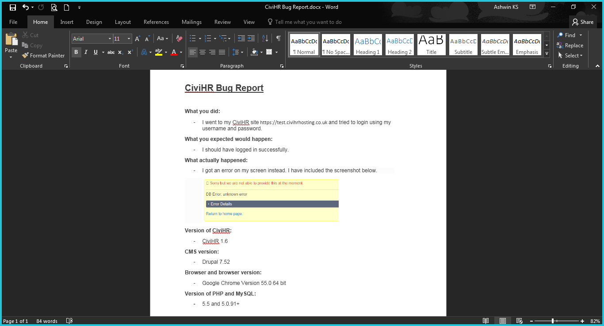

Reporting bugs
==========

Like all software there will be times when you use CiviHR and features don't work the way you expect them to. It is important to share these instances or ‘bugs’ with us, so that we can improve CiviHR for you and other non-profits. The more background you can give on the bug, the better. The best bug reports clearly state:
-   What you did
-   What you expected to happen
-   What actually happened
-   Screenshots of the errors or issue
-   Version of CiviHR
-   Browser and browser version
-   Version of PHP and MySQL

The amount of time taken for the bug to be fixed depends on the severity and complexity of the bug. 

**Reference**: https://docs.civicrm.org/user/en/stable/