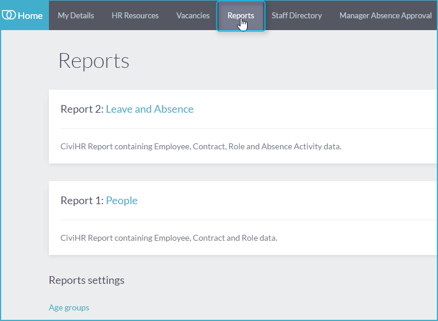
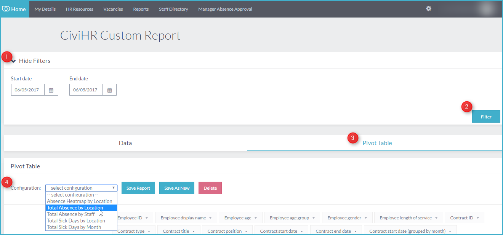
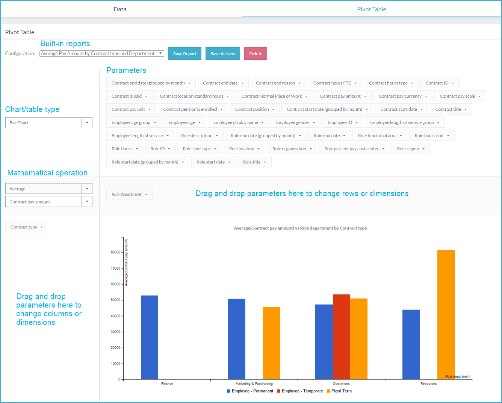
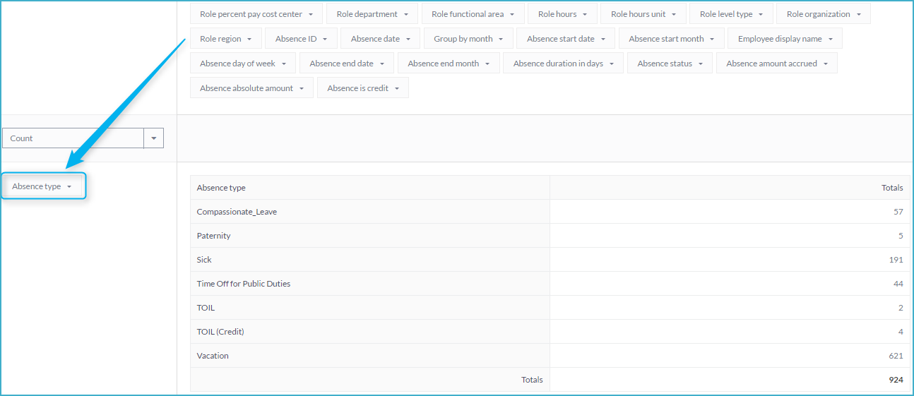
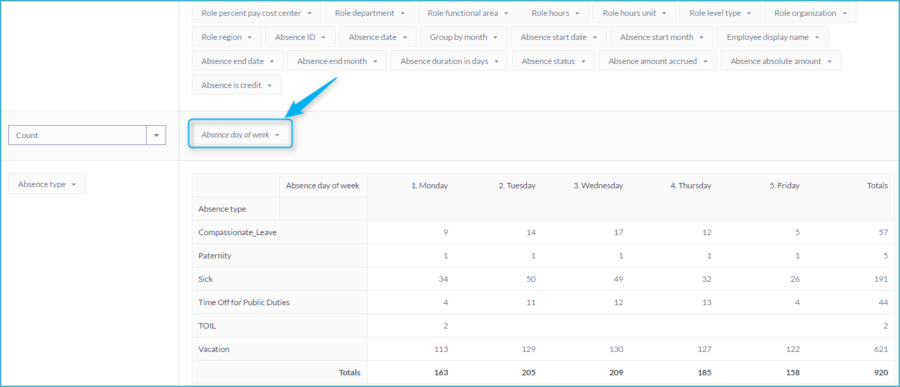
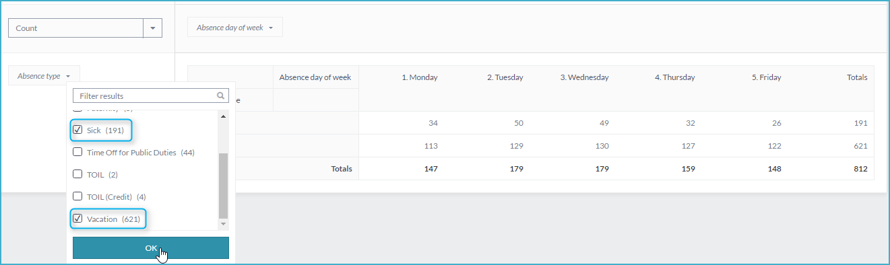
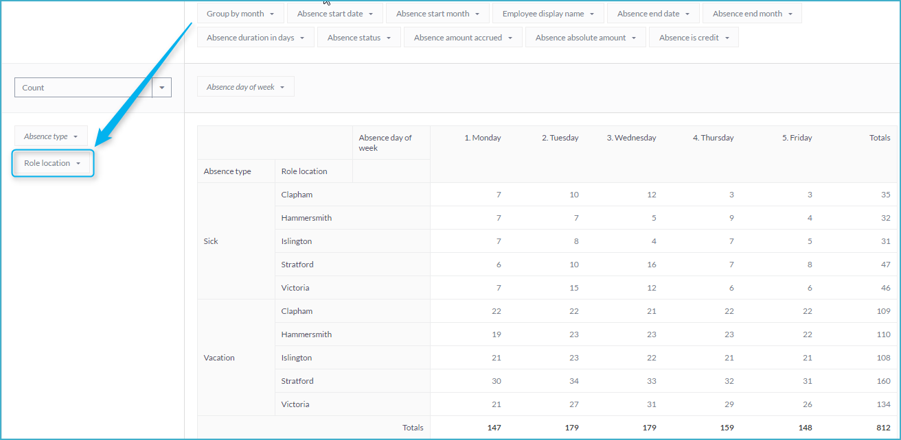
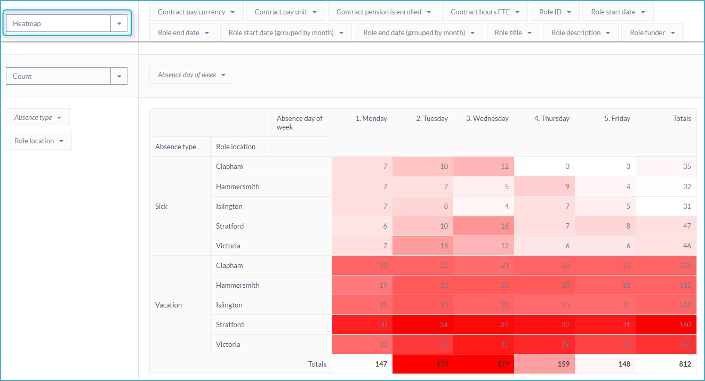
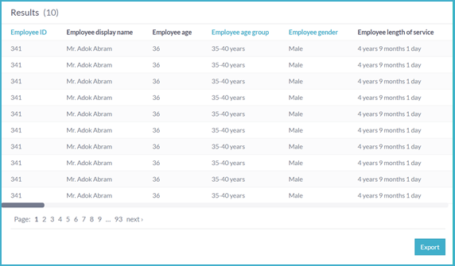
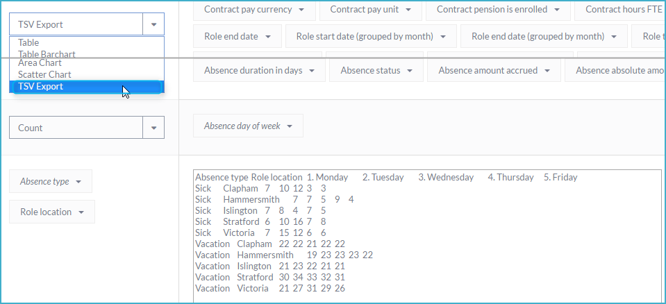

Reports for Administrators
==========

CiviHR allows the creation of a huge variety of reports using a powerful built-in visual tool. 

**Access CiviHR reports**  
---------------

The Reports module is only accessible to Administrators. Login as a CiviHR admin and go to your Self Service Portal. Click on the Reports menu as shown below:

There are two broad categories of reports in CiviHR 1.6: 

-   <b>People reports</b>: Reports on headcount, demographics, job contract and job roles
-   <b>Leave and Absence reports</b>: Reports on absence duration, occurrence, request status, and more. 

From this screen, you can also adjust the age groupings used in reports by clicking <b>Age groups</b> under Reports settings towards the bottom of the screen. From there, you can <b>Edit</b> or <b>Delete</b> age ranges, or <b>Create new Age Group</b> by clicking the appropriate links.

**Use built-in reports**
---------------

CiviHR offers a range of built-in reports such as on headcount, demographics and absence duration. To access built-in reports, click on either People or Leave and Absences reports to see the related report options.

-   Click Show Filters and input the date or date range for which you would like to generate your report
-   Click Filter
-   Click on the Pivot Table tab. 
-   Select the report you would like to use from the Configuration dropdown.

**Customise a built-in report**
-------------

You may want to tweak and save a built-in report so that it meets your reporting requirement perfectly. 

You can change and save:
-   Columns: Drag and drop any parameter on the vertical bar. To remove a parameter, drag and drop the box from the vertical bar into the Parameter area.
-   Rows: Drag and drop any parameter on the horizontal bar. To remove a parameter, drag and drop the box from the horizontal bar into the Parameter area. 
-   Filter values: You can further filter the values you would like to include in your report by clicking the chevron icon on the parameter box and making a selection.
-   Dimensions: You can add more than one parameter on the horizontal and vertical bars to drill further into your data. 
-   Chart or table type: You can change the type of chart or table by clicking the dropdown box showing <b>Table</b> by default and selecting any of the options there. 
-   Mathematical operation: You can change the mathematical operation being performed on your data, for instance from a <b>Count</b> of the number of part-time staff to <b>Average</b> part-time hours. 
Once you have configured the report as you like, you can save it for future use by clicking <b>Save Report</b> or <b>Save as New</b>. Save Report permanently replaces the built-in report. <b>Save as New</b> will bring up a dialogue box where you can name your new report. Your new report will be available from the <b>Configuration</b> dropdown.

**Create a new report**
-------------

Building a new report is very similar to customising an existing report. Let us go through the process of creating and saving a new report using an example:

Building an absence report: Let’s say you want to see the total number of days staff were absent in each office location. 

Go to <b>Self Service Portal -> Reports -> Leave and Absences reports</b>. Click on the pivot table tab here. 

-   Add column: Drag Absence Type into the vertical bar. This gives you a table of the total number of days of leave of each type taken by your staff.

-   Add row: To see the days of the week that these absences fell on, drag <b>Absence Day of the Week</b> onto the horizontal bar.

-   Filter values: Click on the chevron icon next to the parameters you have added into the horizontal and vertical bars. Select the values that you would like to include in your report, uncheck the rest and click OK. 

-   Add dimensions: You can drill further into your data by adding more than one parameter to the horizontal or vertical bars. For example, you can drag and drop location into the vertical bar to break down the above absence data by location. 

-   Select appropriate chart or table type: The report instantly offers more insight when it is viewed as a <b>Heatmap</b> instead of a simple table. 

Save this report for future by clicking <b>Save as New</b> and giving it a suitable name. Your new report will now be available from the <b>Configuration</b> dropdown.

**Exporting your data**
-------------

When you click on People or Leave and Absences reports, you first see your staff data in table form. You can export this data by clicking on the Export button. If you have specified a filtered view, only the filtered data is exported.

You can also export data specific to a particular report. Select TSV (tab-separated values) from the Chart type dropdown. Copy and paste this data into a spreadsheet. 

