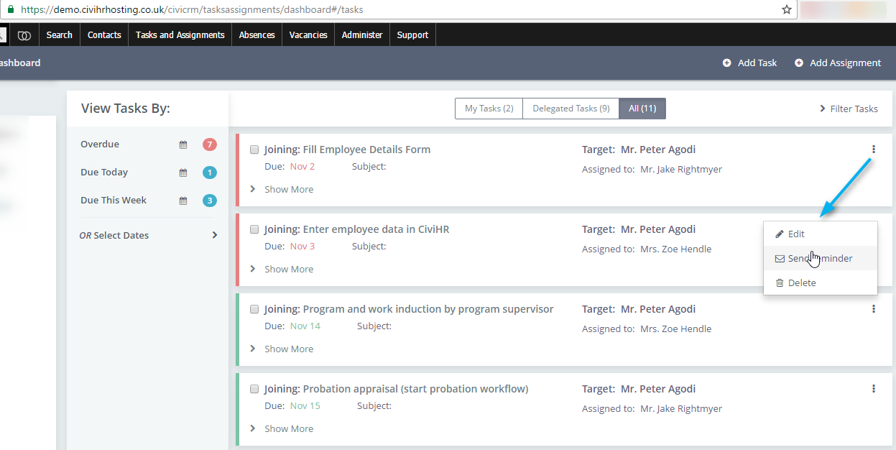
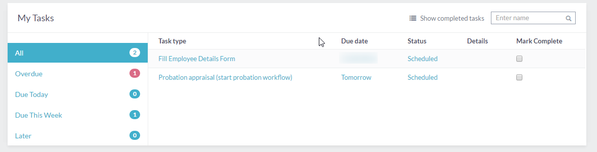

Follow up with quick reminders
==========

Tasks are organised automatically under Overdue, Due Today, and Due This Week on the Tasks Dashboard. Overdue tasks are highlighted in red. You can send quick reminders to the Assignee of any task by clicking on the three-dot Action options and choosing ‘Send Reminder’.

Assignees can see all tasks delegated to them on their self-service portal, where they can mark them Complete when done. This sends an email notification to the person who had created that task. Assignees also get email notifications if the tasks assigned to them are modified, for example if the due date is changed or the task is delegated to someone else. 

Note that the Target contact will not see tasks listed on their self-service portal. 

HR administrators and task assignees get daily digest emails to remind them of their respective tasks and documents that are overdue or upcoming. 
