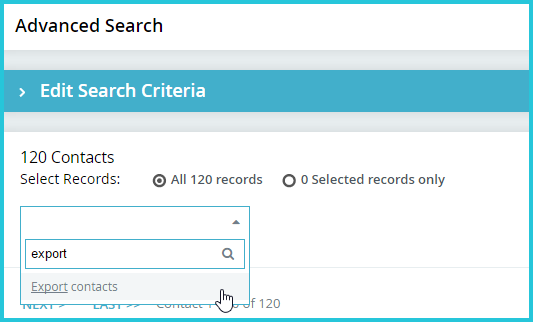
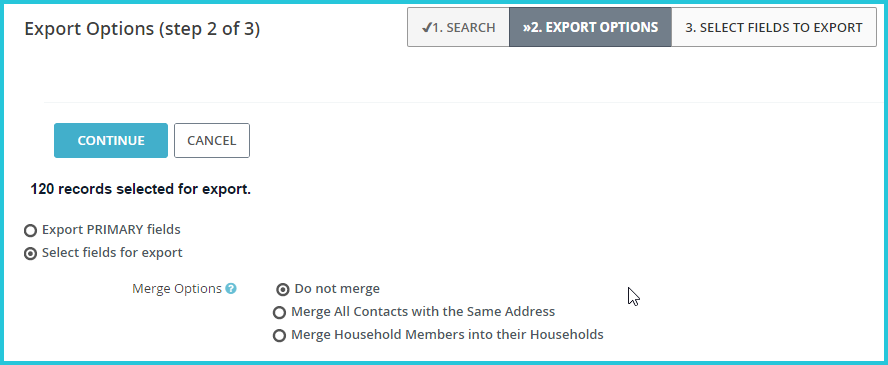
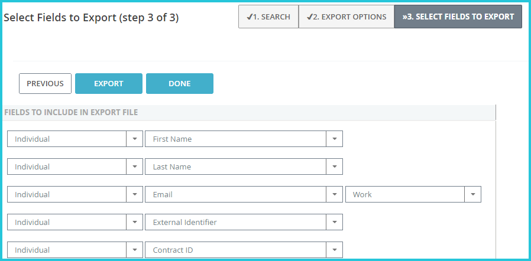
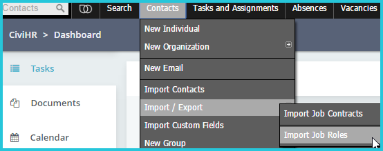

Import job role
==========

You will need to tell CiviHR which job roles should be linked to which job contracts. For this, you must export out the Job Contract ID for all staff members and copy that into the Job Roles CSV file. 

-   Run a search for your staff members using Quick or Advanced Search.

-   Select all staff and pick the Export Contacts option from the Actions dropdown

Pick the Select fields for export option and click Continue

-   Export the following fields:

-   Open the exported CSV file and copy the Contract ID to your Job Roles CSV. 

-   Navigate to the Import Job Roles page as shown:

-   Repeat the import process with the job roles CSV file.
