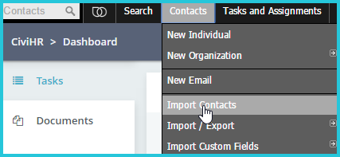
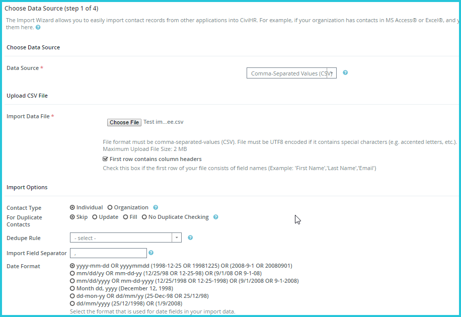
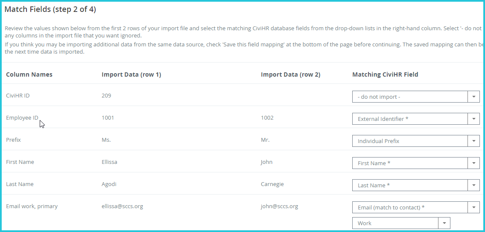
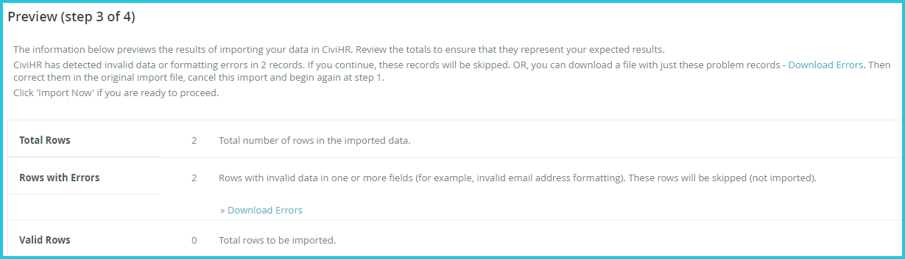

Import personal and bank details
==========

-   Navigate to the Import Contacts page as shown:

-   Select your import CSV file containing contact, demographic and bank data. Confirm whether the first row of the file contains column headers. Select the date format used in your CSV file. Click Continue. 

-   Match fields from your CSV file to appropriate CiviHR fields. 

The first time you import from a particular file, it's a good idea to check the box to "Save this field mapping" at the bottom of this page before continuing. The saved mapping can then be easily reused the next time similar data is imported, by requesting that it be loaded at this step. Click Continue. 

-   Preview: This screen previews the results of importing your data, reports the number of rows to be imported, and allows you to double check your field matches. If some of the rows in your spreadsheet contain data that doesn't match CiviHR’s requirements you'll see an error message. Click the Download Errors link and review the errors reported in the downloaded file, so you can fix them before doing the import. Once you have no errors reported on the Preview screen, click Continue to start the import

-   Summary: This screen shows you how many contacts were successfully imported. 

-   Check to make sure that your import has worked as expected. Search for the contacts that you just imported and examine their staff profiles. 
