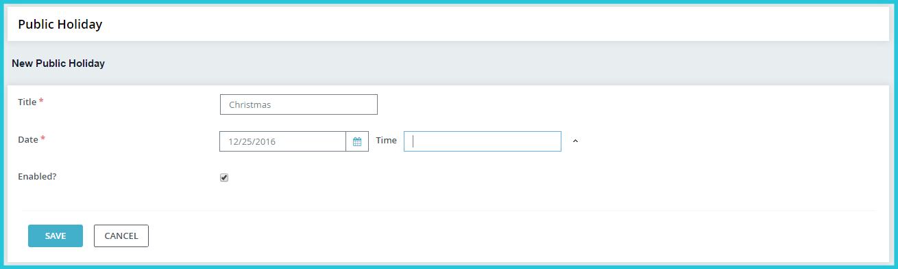
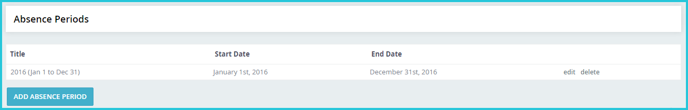
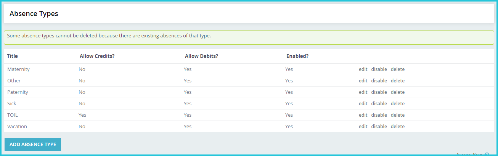

Component-level configuration 
==========

### Configure Absences

**1. Add Public Holidays**

You can add public holidays observed by your organisation at **Absences > Public Holidays**. When anyone books leave for a period spanning a public holiday, these days are not deducted from their leave balance by default. Members of the staff who are required to work on public holidays will be able to change this while submitting their leave request from their self-service portal. 

**2. Add Absence Periods**

An absence period is typically a calendar or financial year. You can add start and end dates depending on your organisation’s leave policy on **Absences > Absence Period**.

You must add an absence period in this screen before your staff are able to apply for leave during that period from their Self Service Portal. Adding a few consecutive absence periods at one go is good practice. 

**3. Add Absence Types**

Add as many absence types as are used by your organisation in **Absences > Absence Type**. Some common absence types such as Time Off in Lieu have been added already for your use. You can add, rename, enable or disable absence types as required. 

