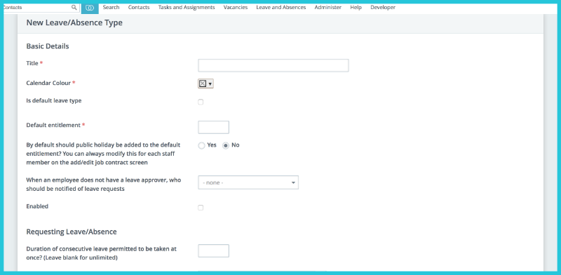
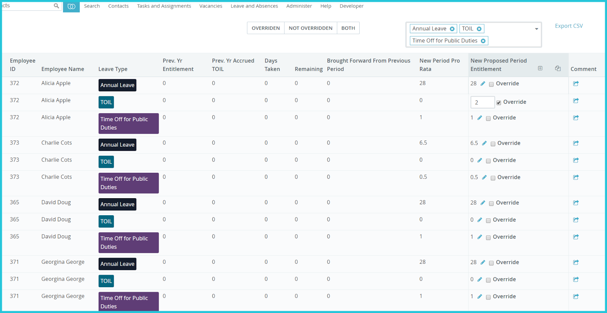
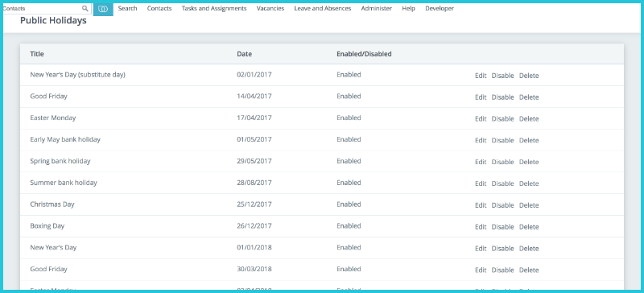
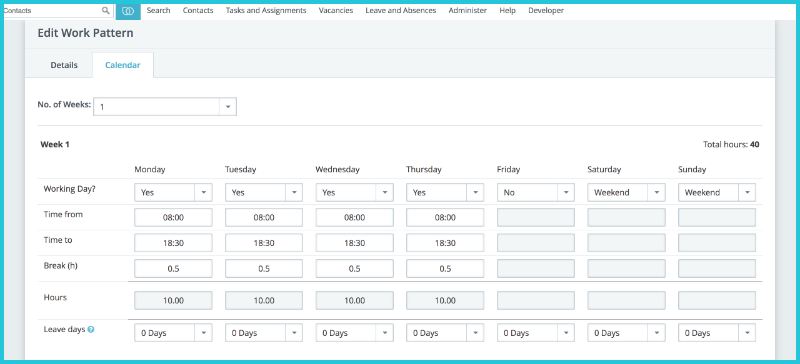
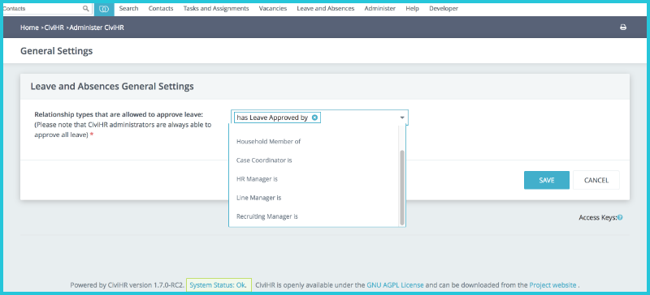
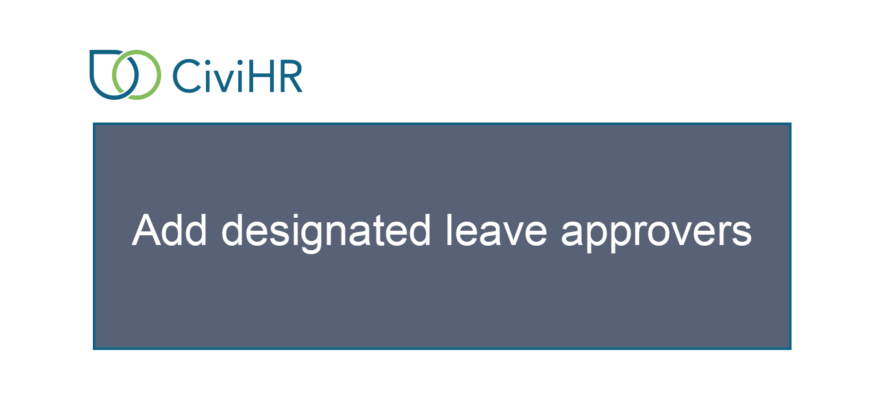

How HR Admin configures Leave
==========

Administrators are able to configure different aspects of the Leave module to accommodate working patterns and leave requests unique to their organisation.  To configure changes in the Leave module, go to **Administer > Leave and Absences**. 

###Leave Types

CiviHR Admin users can create multiple leave types to add to the three standard types if needed. Different rules can be created for each leave types, such as allowing leave to be carried forward for annual leave but not for public duties. Admins are also able to setup a cancellation policy for each leave type.

###Entitlement Periods

Admins can create new entitlement periods as needed. A standard entitlement period runs from the start of the year in January to the end of December but these are configurable. New entitlements will need to be added for each year. 

###Public holidays

These are configurable and unlimited. Admin users can add the dates when the organisation will close, such as Christmas Day or Easter Monday. When a member of staff applies for leave spanning any public holidays, CiviHR does not deduct any time off for that day from their available leave balance. 

###Flexible Work Patterns

With this powerful feature, admin users can set different work patterns to reflect different ways of working for staff within the organisation. For example, alongside the standard 37.5 hours 5-day working week, admins can set up a part-time or compressed hours schedule encompassing fewer days that can be altered on a weekly basis if needed. See the screenshot below for a compressed hours work pattern, where the 40 hour week is conducted over 4 days.

 

###Leave Approver Relationship

The ability to approve leave is designated by relationship types.  Admins are always able to approve leave. They can select relationship types that will allow CiviHR Manager users to approve leave. As a default, leave approval is set to the ‘Has leave approved by’ relationship but any relationship can be used. To amend the leave approval setting, select the ‘General Settings’ option from the Leave and Absences admin menu and choose the relationship that will be used to denote the leave approver. For example, in place of ‘Has leave approved by’, ‘Line Manager is’ could be used instead.  

###Add designated leave approvers

You will need to add one designated leave approver for all your staff members. This leave approver will get alerted when a leave request or sickness report is submitted for their attention. They can then sign into their CiviHR self-service portal and act on the request. Remember that designated leave approvers should be assigned the civihr_manager permission in their self service logins to be able to approve or reject leave requests.

To do this, go to **the staff’s CiviHR profile > Manager** tab for either the manager who will be the leave approver or the staff member. For example, if you are on the Manager tab of Joel’s contact record and you select the relationship type **‘is Leave Approver of’** and type in Anna under **Contact(s)**, this means that now Joel will receive all of Anna’s leave or sickness requests and be able to act on them. 

