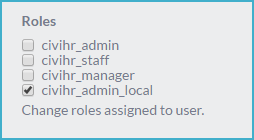
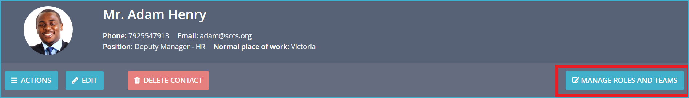
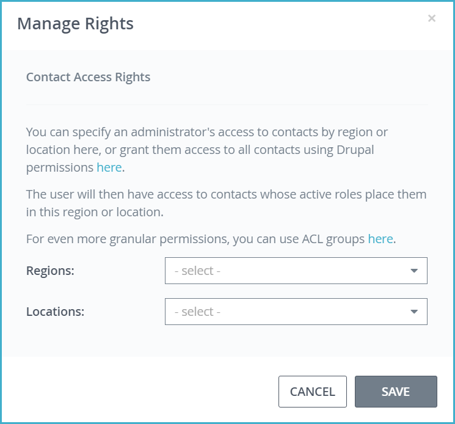
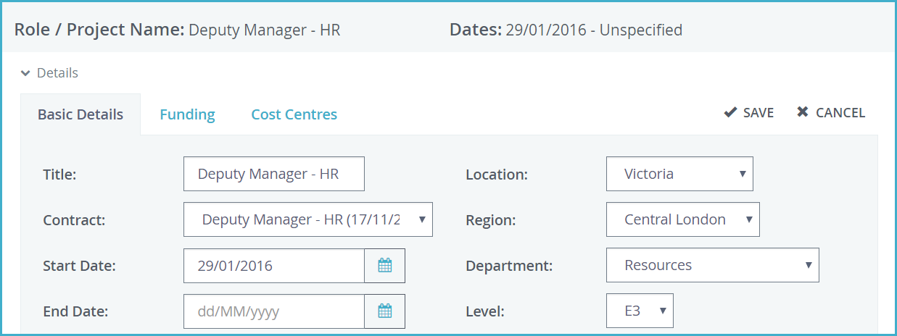

Set up local/regional HR managers
==========

Many organisations work across locations/regions, and may have local HR administrators in their remote offices. The HR team in the central office may want them to only access staff records from their own location/region. For example, the HR manager in the Kenya office should be able to see data for staff in Kenya, but not of staff based in London. At the same time, the team at headquarters should be able to see data for staff in both London and Kenya. 

As admin, you can set up this permission structure. The steps to do so are detailed below:

Step 1: Add the names of the locations/regions that you operate in. 

-   Go to <b>Administer > Customise Data and Screens > Dropdown Options</b>.
-   Edit Work Location and Region dropdown options to include as many locations and regions as you require.  

Step 2: Create login accounts for your local/regional HR managers with appropriate access (role).

-   Go to your self-service page and click on the cog icon in the top menu. 
-   Go to the Manage Users page and click the Add User button. Fill the form that opens up. 
-   Assign the role of civihr_admin_local to your local/regional HR managers. 

Step 3: Specify the locations/regions that each local/regional HR manager will access.

-   Go to the CiviHR staff profile of the local/regional HR manager. 
-   Click on Manage Roles and Teams button. 

-   Select locations or regions that the local/regional HR manager has responsibility for, and save.

-   You can assign multiple Regions and Locations to one user by selecting more than one of each from the relevant dropdowns. 
-   You can assign as many or as few Regions or Locations to a user as you wish. It is not necessary to assign a Region in order to assign a Location, or vice-versa.

Step 4: Make sure that the Location/Region information for all staff is accurately updated. 

-   Go to the CiviHR profile of any staff with an active job contract, and click on the Job Roles tab. 
-   Add/edit a current job role, and select the correct location and/or region. Save this information. 

Note: In CiviHR 1.6, the restrictions to staff data apply to the CiviHR staff record. Local/regional HR manager permissions will still be able to see information about users outside of their locations and regions in the Tasks and Workflows, and Reports modules. The access restrictions will be extended to these modules in a later release.
