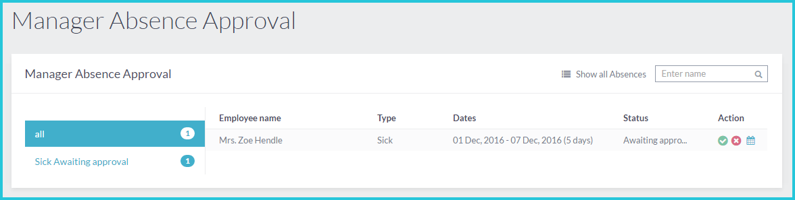

Manager Leave Approval
==========

Approve or reject leave requests
------------------------

If you are the designated Leave Approver for one or more of your colleagues, you will see their leave requests and sickness reports in your self-service portal. You can approve or reject requests, and your colleague will be notified of your decision via email. You can open a calendar view of the leave and sickness history of everyone for whom you are the Leave Approver to help you to take a decision on pending requests. 

