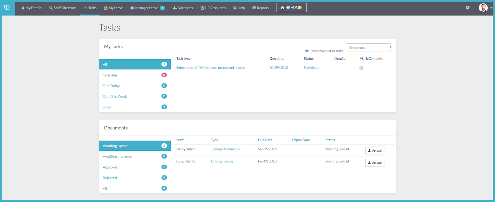

My Tasks
==========

Staff who have been assigned any tasks can see them listed on the My Tasks section on this page. Tasks are automatically sorted by due dates as Overdue, Due Today, Due this Week and Later. Staff can check their completed tasks  to let their HR administrator know that they have been resolved.

Staff who have been assigned any documents to upload can see them listed on the Documents section on this page. Documents are automatically sorted by status as Awaiting Upload, Awaiting Approval, Approved, Rejected & All. 

### Tutorial on How To Upload Document on My Tasks

<iframe style="border: 0 none; min-width: 100%" src="//www.iorad.com/player/105008/Self-Service-Portal-My-Tasks--Uploading-Document?src=iframe" width="100%" height="500px" allowfullscreen="true"></iframe>

The first step is to open Tasks.&amp;nbsp;Staff who have been assigned any tasks can see them listed on My Tasks section on this page.&lt;br&gt;&lt;br&gt;Documents awaiting upload are listed on the Documents section.&lt;br&gt;&lt;br&gt;Click &lt;span&gt;&lt;i&gt;&lt;b&gt;Tasks&lt;/b&gt;&lt;/i&gt;&lt;/span&gt;

To upload a document, click &lt;span&gt;&lt;i&gt;&lt;b&gt;Upload&lt;/b&gt;&lt;/i&gt;&lt;/span&gt;

Click on&amp;nbsp;&lt;span&gt;&lt;i&gt;&lt;b&gt;Drop file here or click to browse&amp;nbsp;&lt;/b&gt;to upload the relevant document.&amp;nbsp;&lt;/i&gt;&lt;/span&gt;

Uploaded File

Next, enter the&amp;nbsp;&lt;span&gt;&lt;i&gt;&lt;b&gt;Document Number&lt;/b&gt;&lt;/i&gt;&lt;/span&gt;&lt;br&gt;

Click on the&amp;nbsp;&lt;i&gt;&lt;b&gt;calendar icon&lt;/b&gt;&lt;/i&gt;&amp;nbsp;to choose date Valid From, or enter date directly in the field.&lt;br&gt;

Click on the&amp;nbsp;&lt;span&gt;&lt;i&gt;&lt;b&gt;calendar icon&lt;/b&gt;&lt;/i&gt;&amp;nbsp;to choose the Expiry date, or enter date directly in the field.&lt;/span&gt;&lt;br&gt;

Click &lt;span class=&quot;&quot;&gt;&lt;i&gt;&lt;b&gt;        Save And Send For Approval.&lt;/b&gt;&lt;/i&gt;&lt;/span&gt;

Notice that the document, once saved and send for approval, has now disappeared from the list of awaiting upload.

Click on&amp;nbsp;&lt;span&gt;&lt;i&gt;&lt;b&gt;Awaiting Approval&lt;/b&gt;&amp;nbsp;to see the saved document.&lt;/i&gt;&lt;/span&gt;&lt;br&gt;

Click&amp;nbsp;&lt;span&gt;&lt;i&gt;&lt;b&gt;View &lt;/b&gt;&lt;/i&gt;to display the saved document&lt;i&gt;.&lt;/i&gt;&lt;/span&gt;&lt;br&gt;

The information entered from the document and the uploaded file has been saved and send for approval.

After a document has been approved, it is automatically listed in the&amp;nbsp;&lt;b&gt;&lt;i&gt;Approved&amp;nbsp;&lt;/i&gt;&lt;/b&gt;&lt;i&gt;&lt;/i&gt;section.&lt;br&gt;&lt;br&gt;Click&amp;nbsp;&lt;b&gt;&lt;i&gt;Approved&lt;/i&gt;&lt;/b&gt;&lt;i&gt;&lt;/i&gt;&amp;nbsp;to see the document&lt;br&gt;

Click &lt;span class=&quot;&quot;&gt;&lt;i&gt;&lt;b&gt;View&lt;/b&gt;&lt;/i&gt; to display the approved document.&lt;/span&gt;

You can also click on&amp;nbsp;&lt;span class=&quot;&quot;&gt;&lt;i&gt;&lt;b&gt;the uploaded file&lt;/b&gt;&lt;/i&gt; to view the document.&lt;/span&gt;

If a document is rejected, it is automatically listed in the&amp;nbsp;&lt;b&gt;&lt;i&gt;Rejected&lt;/i&gt;&lt;/b&gt;&lt;i&gt;&lt;/i&gt; section.&lt;br&gt;&lt;br&gt;Click on&amp;nbsp;&lt;b&gt;&lt;i&gt;Rejected&lt;/i&gt;&lt;/b&gt;&lt;i&gt;&lt;/i&gt; to see the document.

