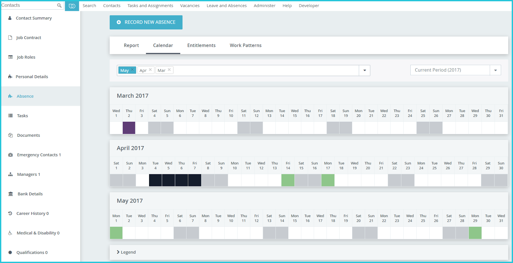

Absence
==========

HR Admin can record leave on behalf of staff from the Absence screen on the staff profile. For more information, please refer to the [Leave Management](/leave-management/how-hr-admin-records-or-reviews-leave-requests/) chapter of this guide. 

The Absence screen has four tabs:

Report
---------------

HR Admin can look up a staff member’s leave entitlement, balance, and approved, rejected, expired, open or cancelled leave requests for any absence period. Clicking on the > icon expands all leave records under that section. HR Admin can review, update or delete leave requests from this screen.

Each staff member sees this same report on the ‘My Leave’ page of their own Self Service Portal.
 

Calendar
---------------

HR Admin can view all approved and open leave requests from the staff in a calendar view. Clicking any colour block brings up the details of that leave request. HR Admin can review, update or delete leave requests from this screen also. The legend at the bottom of the screen gives more information about which colour represents which type of leave. 

Entitlements
---------------

Contract entitlement contains the number of days of leave of each type that the staff member can take for the full absence period, as per their contract. 

Annual entitlement contains the number of days of leave of each type that the staff member can take in a particular absence period. For instance, input pro rata leave entitlement when a staff member joins or exits mid-year.

Clicking on Edit Entitlements allows HR Admin to update the staff member’s annual leave entitlements for a particular absence period.

Work Pattern
---------------

With this powerful feature, HR Admin can set different work patterns for each staff to reflect different working hours. 

For example, alongside the standard 37.5 hours 5-day working week, Hr Admin can set up a part-time or compressed hours schedule encompassing fewer days that can be altered on a weekly basis if needed. 

Clicking on the Add Custom Work Pattern allows the HR Admin to select the particular work pattern that applies to this staff member, along with the date from which this would become applicable.  

