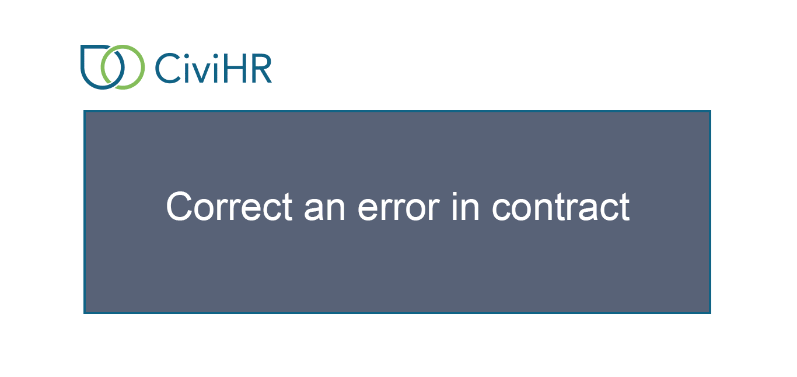
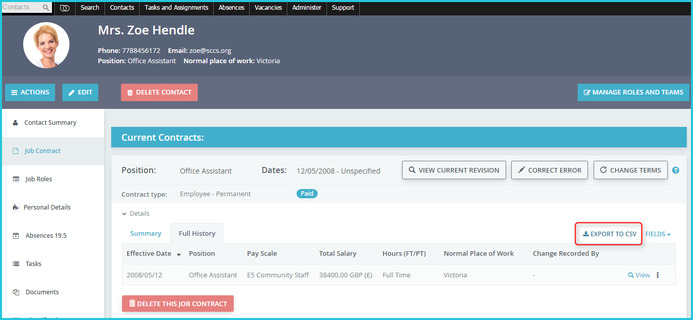

Job Contract
==========

This tab allows you to record the terms of contract of your staff. At any point in time you can add one active contract per staff, and any number of past or future contracts. Contract dates cannot overlap at any point in time. 

Change terms of contract
---------------

When the terms of an employee’s job contract change - for example a  promotion, secondment or increment - you can use this wizard to record a new revision of the contract. A contract history is kept so that you can always see the previous terms of the contract.

To see revisions made to a particular field, click on the time icon next to that field on the job contract Summary tab. To see all contract revisions, go to the Full History tab. 

Correct an error in contract
---------------

If you notice a typographical error with the job contract terms you can correct it by using the Correct Error button. Such changes get saved without adding a new row in the Job Contract History. This helps to maintain an uncluttered record of actual contractual changes.

Export contract revisions
---------------

You can export out the full contractual history of any staff by going to the Full History tab and clicking the Export to CSV button. 

