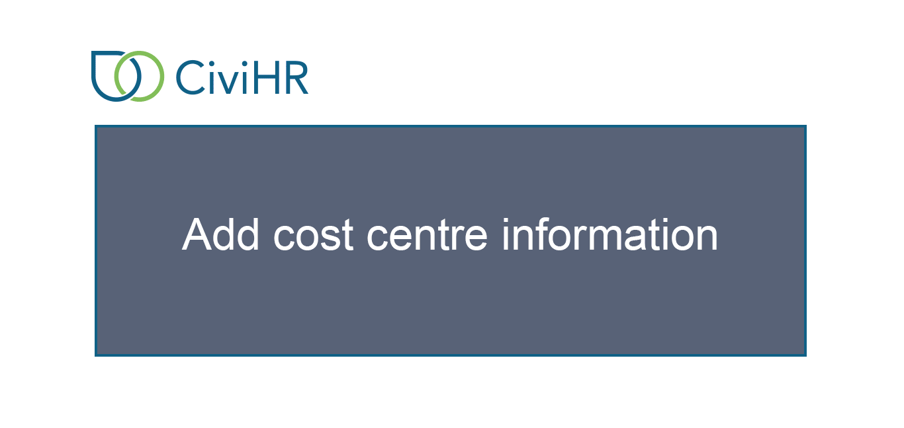

Job Roles
==========

A job role consist of different projects that an individual is working on. It could also be that they work for a part of their time on one position and part on another. You can record your staff’s association with such projects or roles during their term with your organisation. 

A staff member can have multiple active roles at the same time. Each role must be linked to a job contract that the staff member has held with your organisation.  

Add funding information 
---------------

A role may be funded by multiple funders in different proportions. You can record fixed amounts or percent of pay that funders contribute for the particular role. You must add a funder as a New Individual or Organization Contact before you search and select them in this screen. 

Add cost centre information
---------------

Cost centres are usually used to record how the remuneration for a particular role should be booked for budgeting and accounting. A role may be booked under multiple cost centres in different proportions. You must have already added cost centre codes under the Option Groups screen in the Administration section before you can search and select them in this screen.

