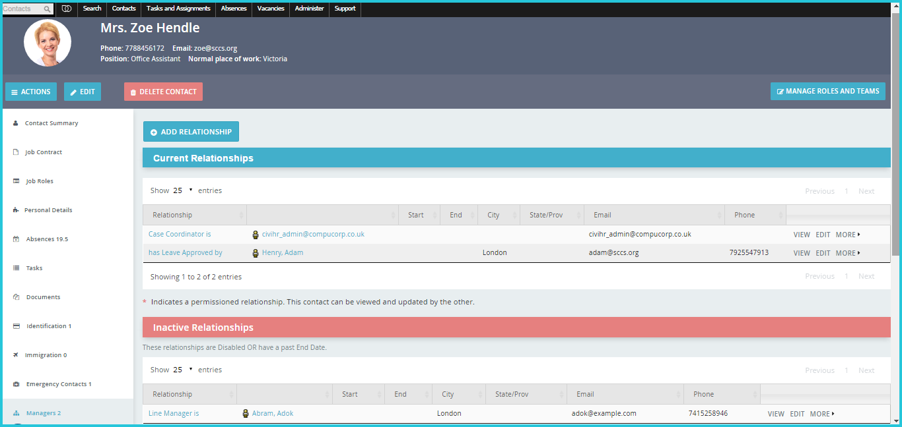

Managers
==========

You can create relationships such as lines of reporting between your staff members here. For example, if you are on Joel’s contact record where you select the relationship type **‘is Leave Approver of’** and type in Anna under **Contact(s)**. This means that now Joel will receive all of Anna’s leave or sickness requests and be able to act on them. 

You can also terminate a relationship when a manager resigns or switches teams. You will be able to view this record under inactive relationships. 