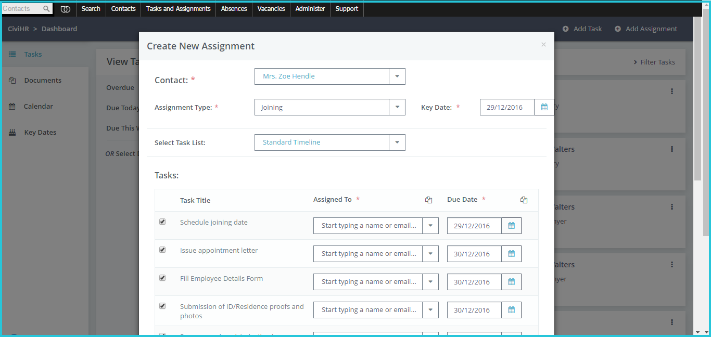
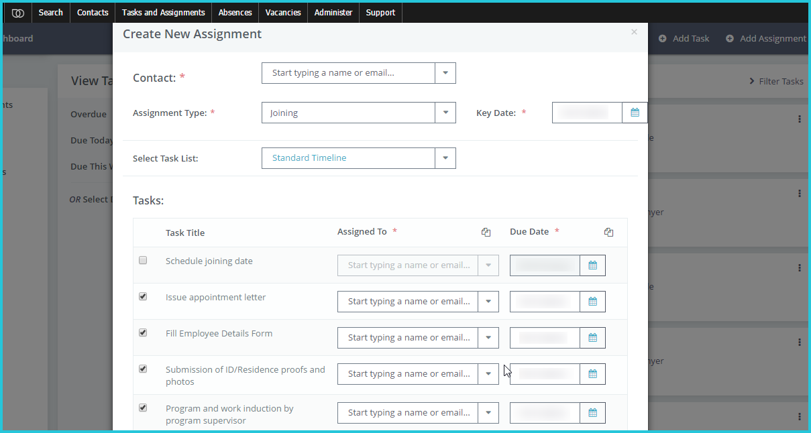

Manage joining, exiting, contract renewals
==========

### Get joining, exiting and contract renewals configured

You can add your organization’s complete task list for routine processes like joining and exiting. These task lists are called **Assignments** in CiviHR.

List the tasks that you must complete for joiners and exiting staff, along a timeline. For example, a joining task list would run as follows:

-   Day 1: Issue appointment letter 
-   Day 1: Collect identification documents
-   Day 2: Induction by supervisor
-   Day 4: Introduction to department heads 
-   .. and so on. 

Your service provider will add these to your CiviHR site. You will be able to delegate and track tasks on this standard list and whenever you onboard staff or process exits.

Adding your organisation’s standard task lists for joining, exiting and contract renewals to CiviHR is a one-time exercise. Now whenever you click on Add Assignment, this standard list will get generated automatically, saving you time and worry about overlooking any task. You can delegate, schedule, add or remove these tasks as required.

These tasks will get listed on your Tasks Dashboard, where you can track and follow up on them as described above. 
