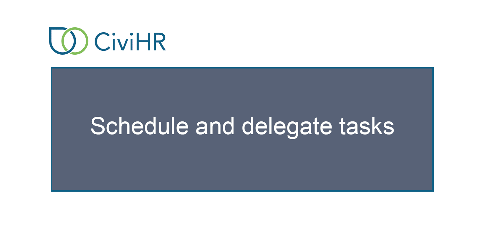

Schedule and delegate tasks
==========

Click the Add Task button on the Tasks Dashboard, and add details to the popup that opens. The person who needs to complete a task is its ‘Assignee’. The person who the task is related to is the ‘Target’. For example, if Jack needs to prepare Amy’s joining letter, Amy would be the Target and Jack the assignee. Once you input the Target, Assignee, Due date and Task type, you will be able to save the task. The Assignee will be notified of the task they are expected to complete via email. The task will get listed on your Tasks Dashboard. 

